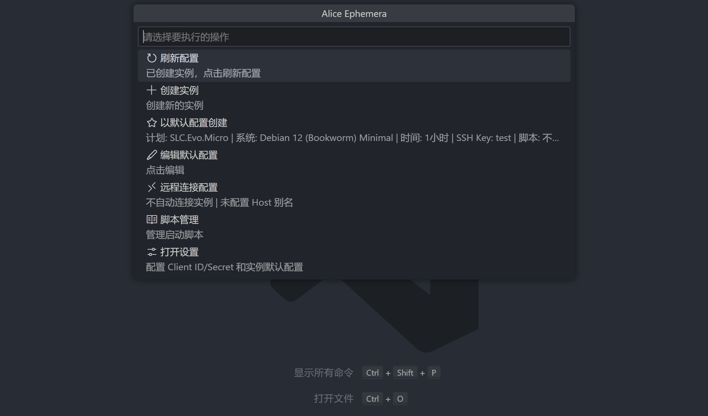

<div align="center">


## ✨ Alice Ephemera ✨

`调用 API 进行 Alice Ephemera 实例管理`

</div>

---

### 🚀 功能

- 创建、删除、重装 EVO 实例
- 显示实例基本信息
- 显示实例到期倒计时，到期前 5 分钟会提醒，可选择续期

### 📦 安装

- 在 VS Code 扩展商店中搜索 "Alice Ephemera" 并安装

### 📝 使用方法

#### 🔌 自动连接与 Remote - SSH 配置（可选但推荐）

1.  安装 [Remote - SSH](https://marketplace.visualstudio.com/items?itemName=ms-vscode-remote.remote-ssh) 扩展，并按照其指引启用 `Remote - SSH` 功能
2.  在本机的 `~/.ssh/config`（Windows 可在用户主目录下新建 `\.ssh\config`）中为 Alice 实例添加 Host 别名，例如：

    ```text
    Host alice-ephemera
        HostName <实例公网域名或 IP>
        User root
        StrictHostKeyChecking no
        UserKnownHostsFile NUL
        IdentityFile ~/.ssh/<你的私钥>
    ```

    - `Host`: 在 `ssh config` 中定义的别名，稍后在 VS Code 设置里需要填写这个名字
    - `HostName`: 实例的公网域名或 IP 地址
    - `User`: 登录实例使用的默认用户，一般为 `root`
    - `StrictHostKeyChecking`（必需）: 设置为 `no` 可以跳过首次连接时的指纹确认，避免自动连接失败，因为每次删除创建实例都会重置指纹
    - `UserKnownHostsFile`（必需）: 指定已知主机文件为 `NUL`，用于在 Windows 上绕过写入 `known_hosts` 的需求
    - `IdentityFile`: 指向可访问实例的私钥路径，请根据实际情况替换，一般是由 https://app.alice.ws/sshkey 创建并下载或自行本地创建再上传

3.  在 VS Code 设置中将 `aliceephemera.autoConnectInstance` 调整为 `true` 或 `new`，并将 `aliceephemera.autoConnectInstanceHost` 填写为上一步配置的 Host 别名（例如 `alice-ephemera`）

完成以上步骤后，插件在创建实例或从控制菜单中选择“远程连接”时，会自动调用 Remote - SSH 命令连接到实例

#### 📋 基本流程

1.  打开 VS Code
2.  点击状态栏配置 API Token
    
3.  配置完 API Token 后即可点击状态栏创建实例，可以设置默认配置方便创建
    
4.  创建完实例默认会在状态栏显示到期倒计时，鼠标悬浮显示具体配置信息，点击即可控制实例
    

### ⚙️ 配置文件说明

Alice Ephemera 的配置位于 VS Code 的设置中

- `aliceephemera.clientId`: 请前往 https://app.alice.ws/api-secrets 获取新的 Client ID
- `aliceephemera.secret`: 请前往 https://app.alice.ws/api-secrets 获取新的 Secret
- `aliceephemera.plan`: 推荐使用菜单修改配置
  - `id`: 配置 ID
  - `os`: 系统镜像 ID
  - `time`: 时长
  - `sshKey`: SSH Key ID（可选）
- `aliceephemera.autoConnectInstance`: 选择是否在实例创建成功后自动通过 Remote - SSH 连接实例
  - `false`: 不自动连接（默认）
  - `true`: 在当前窗口中打开远程连接
  - `new`: 在新窗口中打开远程连接
- `aliceephemera.autoConnectInstanceHost`: 在 Remote-SSH 中配置密钥连接使用的 Host 别名，启用自动连接后会使用此 Host 别名连接到实例

### 📄 许可证

[MIT](LICENSE)
